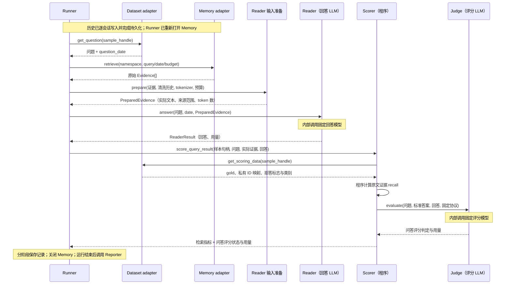
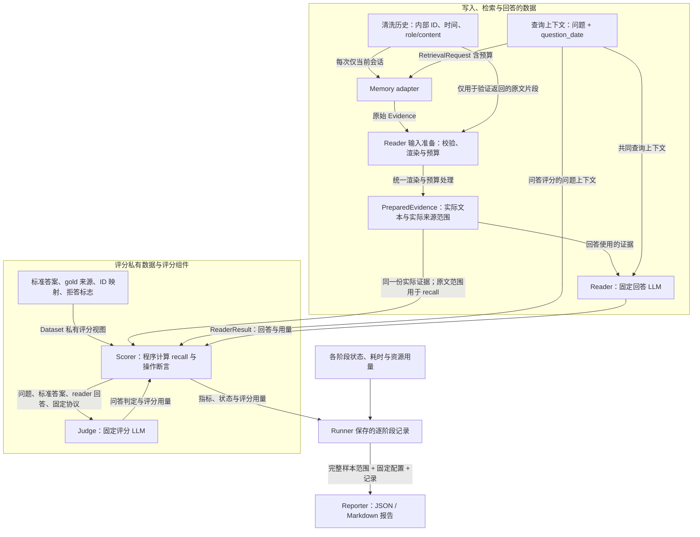

# Memory Eval Harness 第一版设计

状态：设计范围已确认；已根据技术 review、write-design-doc 检查、Evidence 结构评审及整体设计评审修订，尚未实现。

## 背景与问题

Hippo 计划开发供 pi、Codex 和 Claude Code 使用的共享 memory 层，项目方向受 [Agent Memory — The 5-Layer Playbook](../references/Agent%20Memory%20%E2%80%94%20The%205-Layer%20Playbook.pdf) 启发。在选择或实现记忆机制之前，需要一套实验工具，判断新增的记忆提取、整理和检索机制是否改善后续回答，以及付出多少写入成本、查询延迟和上下文用量。

直接在客户端中评测会同时受到 agent 模型、工具选择和客户端集成的影响。先建立独立 memory eval，使历史输入、reader 和评分配置固定，便于定位“未找到证据”“找到证据但回答错误”及“操作能力失败”等不同问题。后续再用端到端任务检验实际编码收益。

第一版的交付目标是可运行、可追溯、可恢复的评测流程及三种对照基线。尚未实现 hippo，因此本设计不设定 hippo 的最低回答分数或性能承诺。Harness 的完成标准是评测协议和产物可以核验；memory 效果由后续实验报告呈现。

## 目标与边界

建立独立、可复现的 memory 层评测工具，在实现 hippo 的记忆机制之前先跑通对照基线。第一版不依赖 pi、Codex 或 Claude Code 的客户端与登录状态，也不预设五层记忆的内部结构。

评测包含三个部分：

- 操作能力：更新、删除、空间隔离和持久化。
- 检索质量：是否返回支持问题的历史证据。
- 辅助问答：固定 reader 根据证据回答，由固定 judge 评分。

Memory 内部可以调用 LLM 提取、总结或整合记忆。操作与检索指标不依赖 reader；辅助问答调用 reader，评分可能调用 judge。记忆构建、回答和评分的用量分别记录。

Agent 自主决定何时使用记忆、跨客户端共享记忆和连续编码任务的成功率，留给后续端到端 suite。

## 关键决策与取舍

下表记录已经确认的选择及其理由；替代方案用于解释取舍，不重新打开已确认决策。模型、依赖版本和具体参数的落实见文末“已确定事项与仍待定事项”。

| 已确认选择 | 理由 | 代价与限制 | 替代或后续扩展 |
| --- | --- | --- | --- |
| 先评 memory 层 | 固定上下游条件，便于归因与回归 | 不直接证明编码任务成功率提升 | 后续加入客户端及连续任务 suite |
| LongMemEval-S 加人工操作测试 | 复用公开问答协议，并验证问答分数无法覆盖的操作语义 | 不是编码场景全集；需校验真实数据版本 | 后续接入 LongMemEval-V2 或其他 agent 轨迹类 benchmark |
| 逐会话写入，并在会话间重新打开 | 接近持续积累和跨会话使用，验证持久化 | 开启/连接及重复维护索引增加运行成本 | 一次性建库保留为历史导入对照 |
| Memory 返回证据，固定 reader 回答 | 将检索错误与回答错误分开 | 结果仍依赖固定 reader；摘要需单独解释来源指标 | Agent 自主使用记忆留到端到端评测 |
| Reader 与 Judge 使用不同家族模型 | 同一模型时自偏好偏差会随各实现产生的答案文本变化，共享盲区还可能奖励检索更差的实现；统一模型只能消除跨条件不可比，不能消除偏差 | 多一个供应商依赖，并需要一次人工一致率校准 | 若要复现论文分数，需回到官方 judge 模型 |
| 4K token 证据预算 | 在相同上下文资源下比较实现 | 预算可能裁掉有用信息；摘要与原文的表达效率不同 | 后续绘制 2K、8K 等预算下的质量与成本曲线 |
| 无记忆、BM25、完整历史三种基线 | 分别对照无历史、简单检索和完整信息条件 | 暂未覆盖向量检索；完整历史不是等预算比较 | 后续加入 embedding 基线 |
| 固定 50 题开发集、450 题保留集 | 控制回归成本并检查调试收益是否推广 | 小开发集的点数变化较粗；公开数据不是秘密测试集 | 两类成绩分别报告，不将开发集成绩当保留集成绩 |
| Python CLI 与 OpenAI-compatible API | 便于接入数据、评分工具和 CI，独立于客户端登录 | 服务端模型多为滚动别名，需另行固定 tokenizer 与版本记录 | 通过 adapter 扩展，不限制插件实现语言 |

## 组件职责与数据流

Runner 是整个评测的调度者：它调用组件、接收返回值、保存阶段记录，再启动下一步。以下组件是 Python harness 内的逻辑模块，不要求部署为独立服务。Reader 和 Judge 分别封装回答模型与评分模型的 LLM 调用；Scorer 中的检索指标和操作断言由程序计算。Memory 内部是否调用 LLM，由被测实现决定。

| 组件 | 谁调用它 | 输入与返回值 | 负责的边界 |
| --- | --- | --- | --- |
| Dataset adapter | Runner；评分时由 Scorer 读取私有视图 | 清洗会话、查询上下文；私有评分数据单独提供 | 校验上游数据，生成内部 ID，将 gold 和 ID 映射保留在评分视图 |
| Runner | CLI | 固定配置与样本清单 → 逐阶段记录、完整运行状态 | 管理空间、逐会话生命周期、修改完成确认、重试与恢复 |
| Memory adapter | Runner | 当前会话或查询请求 → 修改回执或原始证据 | 包装具体实现，执行已声明的写入、检索及操作能力 |
| Reader 输入准备 | Runner | 原始证据、清洗历史、tokenizer、预算 → PreparedEvidence | 验证原文范围，统一渲染并执行预算，记录实际保留的证据 |
| Reader | Runner | 问题、提问时间、PreparedEvidence → ReaderResult | 用固定模型与 prompt 生成回答，不接收 gold |
| Scorer | Runner | 样本句柄、实际证据、ReaderResult → 逐题指标与评分状态 | 在模块内读取私有 gold；计算 recall、调用 Judge，或执行操作断言 |
| Judge | Scorer | 问题、标准答案、reader 回答、固定协议 → 评分判定 | 用固定评分模型判定回答，不参与检索或生成 reader 回答 |
| Judge 协议 adapter | Judge | JudgeRequest、固定协议版本 → 官方协议 prompt 与判定解析 | 按固定版本完成 prompt 构造与结果解析；`protocol_fields` 只允许该协议需要的私有字段，不可用自创 prompt 替代 |
| Reporter | Runner | 逐题记录、固定样本范围及配置 → 汇总报告 | 按适用范围和分母汇总成绩、失败及资源，检查比较条件 |

“Reader 输入准备”属于 harness 的输入准备步骤，可实现为 Runner 调用的函数。它保持 Memory 返回的顺序，执行固定的校验、渲染和预算规则；已经符合格式与预算的内容可原样通过。

流程分为三个阶段：

1. **逐会话写入。** Runner 向 Dataset adapter 读取当前清洗会话，调用 Memory 的 `open → ingest → 完成确认 → close`，再处理下一会话。`ingest` 返回 `accepted` 时调用 `await_ready`；只有 `completed` 后才关闭并继续。查询和 gold 不进入此阶段。
2. **单题检索与评分。** 历史写入结束后，Runner 重新打开同一空间，按下方时序图调用各组件。此图展开正常完成的路径；各阶段的失败及恢复规则见后文。
3. **保存与汇总。** Runner 保存每个阶段的输入、输出、状态、耗时与用量，完成该题后关闭 Memory；所有选定样本进入终态后，调用 Reporter 汇总。Reporter 读取记录，不触发检索、回答或重新评分。

### 调用关系：谁发起调用，谁返回结果

从上往下读时序图。实线表示调用，虚线表示返回；`get_question`、`prepare`、`score_query_result` 等名称用于说明语义，具体 Python API 在实现时定义。

[打开可缩放、可点选的调用图](diagrams/eval-harness-calls.html) · [可编辑图源](diagrams/eval-harness-calls.sequence.json)



检索指标独立于回答评分：图中的 recall 可在证据处理完成后计算。即使 Reader 或 Judge 失败，Runner 仍保留实际证据并让 Scorer 计算适用的 recall；问答部分按失败规则记录，不能因此丢失已经完成的检索结果。人工操作测试采用 `Runner → Memory adapter → Runner → Scorer` 的调用路径，由程序验证操作结果，Reader 和 Judge 均不参与。

### 数据关系：每一步传递什么

调用关系看上方时序图；下图展示数据的去向。Memory、“Reader 输入准备”、Reader 的返回值均先交回 Runner，由 Runner 转交下一组件。私有评分数据由 Scorer 从 Dataset adapter 的评分视图读取。



两个边界决定结果能否解释：Reader 使用的证据和 recall 检查的证据来自同一份 **PreparedEvidence**；预算外或被移除的来源不能计入命中。清洗历史只用于核验 Memory 返回的原文，“Reader 输入准备”不补充检索遗漏的内容。**Gold、标准答案及原始 ID 映射只作为评分输入使用**，可以保存在 harness 的私有追踪产物中，不沿写入、查询或 Reader 路径传递。

| 数据对象 | 必要内容与去向 |
| --- | --- |
| 清洗会话 | 仅当前会话的匿名内部来源、时间戳和白名单消息；进入 `ingest`，不含测试问题或评分标注 |
| RetrievalRequest | 问题、`question_date`、预算；进入 `retrieve`，namespace 单独传入 |
| 原始 Evidence | Memory 返回的原文片段或生成内容；保留内部来源、类型、时间及可用分数，等待验证与预算处理 |
| PreparedEvidence | 实际渲染文本、预算内的证据单元与已验证原文范围、token 数和裁剪记录；文本进入 Reader，结构化视图进入 Scorer 与记录 |
| ReaderResult | 回答、可获得的模型用量与调用状态；用于问答评分和成本记录 |
| 私有评分数据 | 标准答案、官方证据标注、内部 ID 到原始 ID 的映射、拒答标志与类别；只供 Scorer，Judge 接收官方评分协议要求的字段 |
| 逐阶段记录 | 输入输出、回执、状态、指标、失败原因、耗时与用量；由 Runner 保存，Reporter 据此汇总，私有追踪字段不回传 Memory 或 Reader |

以上是数据流概览；字段、类型、可空约定及对象间约束见 [数据契约草案](eval-harness-data-contracts.md)。其中公共输入输出供 Memory adapter 实现；PreparedEvidence、评分标注和运行记录属于 harness 内部结构。

## 数据与划分

主要数据集为 [LongMemEval-S](https://github.com/xiaowu0162/LongMemEval)，固定为 HuggingFace `xiaowu0162/longmemeval-cleaned` 的 `longmemeval_s_cleaned.json`；下载时记录仓库 revision 与文件校验值。`longmemeval_m_cleaned.json` 留作后续更长历史的实验；`longmemeval_oracle.json` 只含证据会话，用作冒烟与调试，不进入正式报告。上游代码仓库与数据集均为 MIT 许可，记录来源链接与核对日期；数据不入 Git。固定分层抽取 50 题作为开发集，其余 450 题作为保留评测集。按能力类别及拒答标志分层，使两个集合都覆盖拒答题。提交样本 ID 清单、抽样脚本和随机种子，确保互不重叠且并集覆盖全部 500 题。

开发集用于调试和日常回归；保留集不用于日常调参，在里程碑运行。两者分别报告。完整 500 题结果明确包含开发集，不代替保留集成绩。

LongMemEval-V2 采用与我们相同的 context gathering 形式——memory 消费历史、返回 compact evidence、再交给下游问答——但其领域是网页与企业 agent，轨迹包含截图，历史规模可达 115M tokens，论文当前标注为 Work in Progress。它列为后续 suite 候选，不在第一版范围内；届时需要扩展消息模型以支持多模态内容。

下载数据及运行结果不提交 Git；保存上游数据版本、文件校验值、下载说明和许可证信息。代码与数据的许可证分别核对。小型人工操作样本可随代码提交。

Dataset adapter 将上游格式转换为：

- 样本 ID、能力类别、测试问题、提问时间 `question_date`、标准答案及显式的 `is_abstention` 标志。能力类别直接使用上游 `question_type` 的六个取值：single-session-user、single-session-assistant、single-session-preference、temporal-reasoning、knowledge-update、multi-session；拒答题由 `question_id` 的 `_abs` 后缀标识。
- 按时间排列的会话，每个会话包含匿名化的来源 ID、时间戳及消息。
- Harness 私有的官方证据标注、原始 ID 映射和用于评分的附加字段。

测试问题、答案和证据标注由 harness 保管，不出现在写入输入中。Memory 在检索时才接收问题和提问时间，始终不接收标准答案或 gold 标注。`is_abstention`、上游样本 ID 和原始来源 ID 也不传给 memory 或 reader；namespace 使用不含样本语义的 ID。

### ID 匿名化与字段隔离

上游数据构建和检索代码使用含 `answer` 的来源 ID 识别证据会话，消息中也可能包含 `has_answer` 标注。因此不能直接转发上游对象：

- 所有会话及消息 ID 转换为稳定、无语义的内部 ID；映射只供 harness 追踪和评分使用。映射生成不能依赖 gold 是否命中，算法、版本及随机种子固定。
- 写入消息采用 `role/content` 字段白名单，并由 harness 附加内部消息 ID；显式移除嵌套 `has_answer` 及其他未获准字段。所有基线使用相同的清洗结果。
- `answer_session_ids` 等标注保存在独立的评分结构中，不进入写入对象、reader prompt 或 adapter 可见的配置。
- 下载固定版本后检查实际字段及 ID 格式，再运行带有 `answer_`、`_abs` 和 `has_answer` 的人工污染样本，断言隔离有效。该检查不预先假设 cleaned 文件已移除这些信息。

上游依据：[官方检索代码](https://github.com/xiaowu0162/LongMemEval/blob/main/src/retrieval/run_retrieval.py)、[官方数据构建代码](https://github.com/xiaowu0162/LongMemEval/blob/main/data/custom_history/sample_haystack_and_timestamp.py)。

## 主要评测协议

1. 为每道题创建独立、空的持久化空间。
2. 按时间顺序逐会话写入。每次仅提供当前会话；实现可读取自己此前保存的状态，不可见未来会话。
3. 确认本次写入已持久化且检索可见后关闭实例，再打开同一空间继续下一会话。持久化数据保留，进程内状态清空；异步写入必须等待明确的完成信号。
4. 最终检索在重新打开的实例中执行，传入问题和数据集提问时间，返回带来源的证据。
5. Harness 按统一预算处理证据，再将证据、问题和同一提问时间交给固定 reader 回答。
6. 计算检索指标，按官方协议评分回答，保存逐题记录。
7. 关闭实例并汇总结果。

逐会话写入是主要协议。一次性建库留作未来历史导入场景的对照。官方问题在历史写入结束后提问；人工操作测试在必要的会话检查点检查当前状态。检查问题和回答不写回记忆。

外部服务型 adapter 必须说明重新打开实例的实际含义，不能将客户端重连描述为后端进程重启。启动、连接、写入和检索耗时分别记录。

时间基准统一使用 `question_date`，不能用机器当前时间或最后一个历史会话日期替代。该日期也提供给无记忆基线，属于共同的查询上下文而非历史记忆。上游依据：[官方生成代码](https://github.com/xiaowu0162/LongMemEval/blob/main/src/generation/run_generation.py)。

### 贯穿场景：包管理器约定更新

以下人工样本用于说明协议，不是 LongMemEval 的原始题目，也不预先规定真实 memory 一定通过：

| 时点 | 输入或操作 | 预期可观察行为 |
| --- | --- | --- |
| 会话一，2026-09-01 | “项目使用 npm。” | 只将该会话写入独立空间；确认 completed 后关闭实例 |
| 会话二，2026-09-03 | 重新打开，写入“迁移到 pnpm，以后都用 pnpm。” | Memory 可读此前状态；支持自动更新测试时，新值为 current，旧值若保留为 superseded |
| 会话三，2026-09-05 | 重新打开，写入“CI 和本地都已完成迁移。” | 持续积累状态，不提前接收最终问题；完成后关闭 |
| 最终查询，2026-09-06 | 重新打开，检索“这个项目现在使用什么包管理器？” | request 携带该 question_date；返回内部来源 ID 及证据 |
| 证据处理 | 按返回顺序验证并执行 4K 预算 | 原文范围与实际保留文本一致；完全移除的来源不计命中 |
| 辅助问答 | Reader 接收同一问题、提问时间和实际证据 | 正确回答应为 pnpm；judge 按固定协议判定，原文 recall 独立计算 |
| 操作检查 | 在会话一、二完成后进行检查点查询 | 验证当前约定从 npm 改为 pnpm；检查问题和回答不写回 memory |

如果实现事先声明为纯生成模式，最终证据是仅含“当前使用 pnpm”的生成摘要，可以正常参加辅助问答，其原文 recall 为 N/A。若实现声明提供原文检索但本题没有提供原文，原文 recall 为零。返回带原文范围的会话二片段时可核验来源覆盖；来源命中仍不代替答案评分。该场景中的自动更新状态检查与最终问答分别记录，不能用问答正确推断更新操作通过。

## Memory Adapter

以下为语义接口草案，所引用的数据类型及能力字符串见 [数据契约草案](eval-harness-data-contracts.md)。类型尚未实现；实现时将其落实为可校验、可序列化的 Python 对象。

```python
capabilities() -> set[str]
reset(namespace: str) -> None  # 返回时空间已清空，旧任务不会再次写入
open(namespace: str) -> None
ingest(namespace: str, session: Session, operation_id: str) -> MutationReceipt
retrieve(namespace: str, request: RetrievalRequest) -> list[Evidence]
close(namespace: str) -> None

# 异步 adapter 提供；同步 adapter 返回 completed 回执
await_ready(namespace: str, operation_id: str, timeout: float) -> MutationReceipt

# 可选操作与状态检查能力
update(namespace: str, memory_id: str, replacement: str, operation_id: str) -> MutationReceipt
delete(namespace: str, memory_id: str, operation_id: str) -> MutationReceipt
inspect(namespace: str, memory_ids: list[str]) -> list[MemoryState]
```

`RetrievalRequest` 包含问题文本、`question_date` 和 token 预算。Namespace 是评测使用的独立空间，不要求底层实现采用特定数据库或存储结构。

`replacement` 是目标记忆的完整替换文本；不按部分字段合并。`timeout` 单位为秒。`reset/open/close` 正常完成返回 None，失败进入调用尝试的错误记录；`retrieve` 成功但无匹配结果返回空列表，调用错误不能伪装为空列表。

### Evidence 的结构与含义

Evidence 是一次检索返回的证据单元，由结构化内容与来源信息组成。`kind` 表示输出是原文片段还是生成内容；它不表示 episodic、semantic 或 procedural 记忆类型。摘要、事实或流程都可作为生成内容返回；这不代表第一版已包含针对这些记忆类型的专门 suite。

每条 Evidence 包含 `text`、`kind`、`extractive_span`、`derivation_sources`、`source_times` 和可空的 `retrieval_score`。来源只使用清洗后的内部 ID；来源时间未知时显式保留空列表，不使用机器当前时间。不存在自然检索分数时为 null，分数不可跨实现直接比较，也不用于重排返回顺序。Evidence 不携带记忆身份与有效性：它引用的来源可被核验，而“这条内容属于哪条可操作记忆”属于实现内部；操作目标取自回执，状态由 `inspect` 按稳定 ID 查询。`retrieve` 的返回受排名和预算限制，不能代替状态检查。

例如，假设某条清洗消息的完整内容是 `项目使用 pnpm。`，原文证据可以返回：

```json
{
  "kind": "extractive",
  "text": "项目使用 pnpm。",
  "extractive_span": {
    "session_id": "s_f72c",
    "msg_id": "m_40b1",
    "start": 0,
    "end": 10
  },
  "derivation_sources": [],
  "source_times": ["2026-09-03"],
  "retrieval_score": null
}
```

`[start, end)` 使用清洗消息的 Python Unicode 字符索引，因此这里等于 `content[0:10]`；不是字节或 token 范围。完整字段定义及生成内容示例见 [数据契约草案](eval-harness-data-contracts.md)。

证据区分两类：

- **原文片段**：标记 `kind=extractive`，提供内部会话 ID、消息 ID 及该消息中的文本范围。Harness 根据清洗后的历史验证片段与范围一致，禁止仅凭 adapter 声称的来源命中计分。
- **生成内容**：标记 `kind=generated`，允许摘要或合并记忆；`derivation_sources` 描述生成来源，用于追踪，但不直接作为证据召回的命中依据。可附带原文片段作为单独的证据单元，实际展示的原文也必须计入预算。

原文来源关系绑定到具体片段，不能只给一份整条摘要的来源并集。`derivation_sources` 保存在诊断记录中，不作为 reader 的额外提示。它由 adapter 自报，只用于诊断追踪，既不证明生成内容正确，也不能作为更新或删除是否生效的判定依据——删除是否生效以目标和衍生内容是否仍可召回为准。

### 修改回执与操作状态

`MutationReceipt` 包含 operation ID、稳定的记忆 ID、来源、状态（`accepted/completed/failed`）和可获得的资源用量。`completed` 表示修改已持久化、相关索引已更新，重新打开后可观察到修改；删除完成意味着查询不再暴露目标内容及其受影响的衍生内容。`accepted` 仅表示任务已接收，runner 必须调用 `await_ready` 并在超时前得到 `completed` 才继续。提交与等待的耗时均计入修改耗时，完成状态查询不能重复提交修改。

`close` 不替代完成确认。`reset` 必须取消或隔离旧任务，防止重放后旧任务再次污染空间；异步后端无法保证这一点时，重放使用新的物理空间并隔离旧空间。具体后端能力写入配置与结果。

操作测试需要可观察状态。`MemoryState` 包含稳定记忆 ID、内容、内部来源、`validity`（`current/superseded/deleted/unknown`）及可获得的替代关系。状态断言只通过 `inspect` 按稳定 ID 查询：`retrieve` 返回的是受排名和预算影响的 top-k，不能指定目标 ID，因此检索结果不构成等价的状态暴露方式，Evidence 结构也不包含有效性字段。runner 不从自由文本中猜测有效性。普通问答评测不强制要求状态接口；缺少相应状态能力的操作测试标记为“不支持”。

Memory 返回证据，不直接承担最终答案生成。只实现写入与检索的 adapter 可以参与辅助问答评测；没有实现的操作能力标记为“不支持”，不记为通过。

## 基线

| 基线 | 行为 | 预算规则 |
| --- | --- | --- |
| 无记忆 | Reader 看到问题及提问时间，不提供历史证据 | 无历史证据 |
| BM25 | 逐会话持久化索引，检索历史片段 | 与 hippo 相同的 4K 证据预算 |
| 完整历史 | 按时间提供全部历史 | 单独报告，不受 4K 检索预算限制 |

完整历史超出 reader 上下文限制时明确标记为不可运行，不静默截断。其结果用于信息充分程度的对照，不作为等预算检索结果。BM25 沿用上游 `flat-bm25` 的分词与打分定义，分词、k1、b 使用上游默认值不做调优，只记录实现 commit；文档单元为单个会话（会话内消息按时间拼接），返回 k = 10 个会话，并列时按（分数降序、会话时间升序、session_id 字典序）稳定排序。命中会话按会话内顺序逐消息展开为消息级原文证据，以满足“一个原文单元只引用一个消息范围”的约束，预算截断在展开之后执行。

M2 落成（#8）时上述“上游定义”绑定到具体实现：commit `9e0b455f4ef0e2ab8f2e582289761153549043fc`（`src/retrieval/run_retrieval.py`）。文档单元按上游会话粒度实现——会话内 **user 轮次** 内容以单个空格拼接（上游按 `role == 'user'` 过滤，assistant/tool 轮次不入索引，但命中会话展开为消息级证据时全部轮次都返回）；分词为上游的 `doc.split(" ")`（纯空白切分，不做小写化或词干化），查询同法分词；打分用 `rank_bm25.BM25Okapi` 默认参数（k1=1.5、b=0.75、epsilon=0.25），k1/b 不进配置、不可调优；k=10 可经 memory 配置覆盖（M2 待复核参数）。

本设计的 reader 上下文为 1M tokens，LongMemEval-S 的完整历史约 115k tokens，因此完整历史基线在 S 上预期全部可运行，`context_exceeded` 主要出现在更长的历史或上下文更小的 reader 配置下。论文的 reader 使用 128k 上下文，本 harness 的绝对值与论文不可比，比较只在本 harness 内成立。

上下文预检包含历史、问题、公共 prompt、消息格式开销及预留输出长度；预留输出长度按 reader 配置固定，不取模型的最大输出上限。失败使用 `context_exceeded` 状态。完整历史的无排名输出和无记忆基线不参加排名检索指标，两者仍参加辅助问答，按下述统一状态与统计规则报告。声明提供原文检索的 BM25/hippo 才参与对应的原文 recall 比较。

第一版无需已有 hippo 实现，也暂不加入向量检索。未来通过相同 adapter 接入。

## Token 预算与模型配置

检索输出默认预算为 4096 tokens，包含证据文本、来源元数据和最终证据格式的分隔内容。问题及公共 prompt 不计入证据预算，但计入总调用用量。

预算对 harness 是硬上限，对 adapter 是提示而非义务：harness 按返回顺序保留内容，超出预算时截断；原文片段只保留前缀时同步缩小文本范围，某个来源对应的片段被完全移除时该来源不计入实际证据。adapter 可以按 `RetrievalRequest.evidence_token_budget` 自行收敛，这属于可选优化，不收敛不判失败。两种做法都会出现，因此报告必须给出每次检索的返回条目数、进入 Reader 的条目数、被移除或截断的条目数与 tokens；这些数字用于解释结果，不参与排名。不能保留一份与剩余文本不对应的完整来源集合。

每个原文证据单元使用一个消息范围，避免多来源单元被截断后无法确定来源。Reader 中的来源元数据保持完整，无法容纳元数据及任何非空文本时跳过该单元。来源时间由 harness 按固定格式渲染，adapter 提供的字符串不直接作为自由文本进入 Reader；无法按约定格式解析的时间不渲染，只保留在诊断记录中并在结果里标记。最终渲染后重新计数，保证文本、元数据和分隔内容总量不超预算。生成内容截断后仍可辅助问答，但生成来源不计入可核验召回。

保存截断后实际送入 reader 的证据及其更新后的来源范围。检索指标基于这些实际证据计算，截断前结果另存用于诊断。问题、提问时间和公共 prompt 不计入证据预算，均计入总调用用量。

报告同时给出证据预算的构成，即各单元文本与来源元数据、分隔符各占多少 tokens。单元粒度由 adapter 决定，碎片化返回会抬高每条证据的元数据开销，这一诊断用于避免把粒度差异误读为检索质量差异；它不改变预算规则，也不参与排名。

配置必须明确指定 reader 对应的 tokenizer。无法精确匹配时标记估算模式，与精确计数结果分开比较。未来可加入 2K、8K 等预算实验。

Reader 和 judge 通过 OpenAI-compatible API 调用，分别配置 base URL、模型名和凭证环境变量名；实际凭证不写入配置快照、日志或结果。首版固定为：

| 角色 | 模型 | 端点 | 必须固定的参数 |
| --- | --- | --- | --- |
| Reader | `deepseek-flash`（服务端版本 DeepSeek-V4.1-Flash，1M 上下文） | `https://api.deepseek.com` | thinking 开关、reasoning effort、temperature、输出预留长度 |
| Judge | `glm-5.3`（Z.ai） | `https://api.z.ai/api/paas/v4/`（coding plan 端点为 `https://api.z.ai/api/coding/paas/v4`） | thinking 开关、reasoning effort、temperature、官方协议 prompt 版本 |

两者必须属于不同模型家族。同一个模型同时承担 reader 和 judge 时，自偏好偏差会随各实现产生的答案文本变化，reader 与 judge 共享的知识盲区还可能奖励检索更差的实现；把两者统一到同一模型只能消除“跨条件不可比”，不能消除偏差本身。

`deepseek-flash` 与 `glm-5.3` 都是滚动别名：厂商可以把同一个名字指向新的模型，配置文本不变。DeepSeek 已把旧名 `deepseek-v4-flash` 路由到 V4.1-Flash 并计划移除，这就是实际发生过的漂移。两个模型的参数规模使其自托管不在第一版可行范围内，因此不追求位级可复现，改用“漂移可发现、历史可复核”的策略：

- 每次正式 run 记录四项：配置中的别名、服务端响应里的 `model` 字段、厂商文档当时标注的版本、运行日期。
- 正式运行前重读厂商的版本说明。版本与上次运行不一致时判为配置变更，不与历史 run 做同条件比较。
- reader 与 judge 的每次调用留档 prompt、原始输出、解析结果、`model` 字段与用量，使模型漂移后历史 run 仍可审计。
- 每次正式运行开头执行一组固定的探测 prompt（首版 10 条，题面与期望行为写入配置）并保存输出。两次运行的探测输出明显不同，即判为模型变更。

位级可复现不成立：相同输入不保证相同输出，别名也可能被随时重新指向；报告必须写明这一限制。若将来需要严格复现，改用提供固定快照的托管商，而不是继续依赖滚动别名。

Reader 的 tokenizer 使用 DeepSeek 官方离线 tokenizer 精确计数，并用每次调用返回的 `usage` 反查实际 prompt tokens 做校准；两者不一致时记录差值，预算执行仍以本地计数为准并标明计数模式。

M2 落成（#8）：精确计数加载 revision 固定的 `deepseek-ai/DeepSeek-V3` `tokenizer.json`（pin 记录含 sha256/大小/许可/核对日期，文件不入 Git，经 `scripts/fetch_deepseek_tokenizer.py` 获取并在加载时复核校验值）；`counting_mode` 三态——`exact`（上述精确计数）、`estimated`（文档化启发式 ceil(chars/4)，结果标记估算口径）、`test`（M1 字符计数器，仅离线）。计数模式与 tokenizer id 是可比性关键项：估算与精确结果分开比较，绝不并表。校准差值落在逐次调用的 `ReaderResult.calibration` 与报告诊断块（差值≠0 计数、均值/最大差值），不进入正式指标。上下文预检按配置字段执行：`context_window_tokens`（不设则不预检，M1 行为保持）、`format_overhead_tokens`（消息格式开销的扁平估计）、`output_reserve_tokens`（固定输出预留，不取模型最大输出上限）、`prompt_template_id`（公共 prompt 模板注册表）。预检构成 = 公共 prompt+问题 + 证据（等预算基线取证据预算上界、完整历史取实际全量渲染）+ 消息格式开销 + 固定输出预留；超限记 `context_exceeded`（终态、先于一切 adapter 与模型调用、可运行覆盖率因此有真实分母）。

Judge 沿用 LongMemEval 官方 prompt 模板与 yes/no 解析语义，但所用模型不同于官方验证过的 GPT-4o，因此不宣称与论文分数可比，也不复用论文“与专家一致率 ≥90%”的结论。首版按下文“Judge 校准”执行：100 条随机样本加 20 条边界样本，单人盲标并做自身一致性复核；未达标的配置不得用于正式结论。

每次实验固定并保存：数据版本与校验值、样本清单、代码版本、指标注册表版本、memory 配置、reader/judge 模型标识及可获得的版本、生成参数、prompt 内容与校验值、评分协议版本、tokenizer、证据预算，以及模型漂移探测的输出。服务端未提供不可变模型版本时，明确记录这一可复现性限制。

## 评分与指标

### 指标注册表

进入报告和比较的每个指标都在指标注册表中定义，至少包含：稳定的 `metric_id`、版本、所属 suite 与证据模式、计数单位、分母、N/A 条件、是否为排名指标。M1 固定首版注册表，并把注册表版本写入配置指纹。比较命令要求双方注册表版本一致；名称相同但版本不同的指标不能自动对齐，未登记的指标只能作为明确标记的诊断项，不参与比较和排名。

首版登记的指标包括：可核验 session recall 的宏平均与微平均、`Recall@k`、4K 预算内全部实际原文的 session recall、`derivation_source_coverage`、计划题目整体得分、成功评分题准确率、可运行覆盖率、拒答准确率、逐题归因分布、操作通过率与支持覆盖率，以及资源与预算构成项。`Recall@k` 的 k 取 1、3、5；k 集是报告口径而不是质量目标，调整 k 集视为注册表版本变更，需要重新生成可比较的基准。

### 检索

Dataset adapter 依据上游规则显式识别 `is_abstention`；官方当前使用样本 ID 的 `_abs` 后缀。拒答题的所有 recall 指标均标为 N/A，即使其来源数组非空也不参与检索聚合。固定版本应核对官方预期的 30 道拒答题。非拒答题缺失 gold 来源视为数据校验错误，不能静默排除。上游依据：[官方检索统计代码](https://github.com/xiaowu0162/LongMemEval/blob/main/src/evaluation/print_retrieval_metrics.py)。

可核验 session recall 使用实际展示的原文片段来源计算。Harness 私有地将内部 ID 映射回官方 ID；对 gold 来源集合 G 和实际原文来源集合 R，召回率为 `|G ∩ R| / |G|`。仅元数据出现、生成摘要的来源并集或已被截断移除的片段不能加入 R。

`Recall@k`（k 取 1、3、5，见指标注册表）指实际原文证据对应的前 k 个不同会话，按证据返回顺序首次出现排序并去重。另报告 4K 预算下全部实际原文的 session recall。该指标是我们定义的会话覆盖指标，不自动等同于上游不同粒度下的 top-k 分数。即使来源命中，片段也可能没有包含答案事实；这一局限由下文的联合归因分布单独呈现，不靠 recall 总分解释。

只返回生成内容且未声明提供原文证据的实现，其可核验 recall 标为 N/A，不将生成来源包装成证据召回。对于混合输出，指标明确标记“原文部分”，同时报告生成内容及原文各占多少 tokens；声明支持原文检索但本题未返回原文的实现，R 为空，记零分。报告每项指标的适用样本数及 N/A 原因，不能跨不同证据模式直接比较 recall 总分。

生成来源的诊断性覆盖率可另行报告，但名称必须明确为 `derivation_source_coverage`，不得称为证据召回率。统计总体与分类指标，记录证据条数及实际 tokens。

### 适用范围、状态与统计分母

一次运行先固定所选题目集合 P，再进行数据及配置校验。必填字段、非拒答 gold 来源或 ID 映射无效时标记 `invalid_input` 并阻塞正式调用；若在运行后才发现，已有成绩标为无效。修正后开启新 run，不产生可比较的旧正式成绩，也不能静默移除坏题并缩小 P。

以下状态用于不同统计层级，状态记录必须注明所属 suite、题目及指标：

| 状态 | 含义 | 统计规则 |
| --- | --- | --- |
| scored | 回答已成功评分，结果可以正确或错误 | 纳入问答全部题目和成功评分题的分母 |
| failed | 重试/恢复策略执行后仍有运行错误，记录失败阶段 | 对计划题目问答整体得分贡献零；失败数量与原因单列 |
| context_exceeded | 按固定模型限制预检，完整输入无法运行 | 不伪装成已评分错误答案；对计划题目问答整体得分贡献零，数量单列 |
| not_supported | 运行前未声明某个可选操作或检索指标所需能力 | 该能力结果为 N/A，报告不支持数量；不作为操作通过或失败 |
| not_applicable | 指标语义不适用，例如拒答题的 recall | 仅该指标为 N/A，其他适用评测正常执行 |
| pending | 尚未完成或仍待恢复 | 保留中间进度；不能将该运行标为完整正式报告 |

可选能力和证据模式在运行前声明并固定，不能在失败后改为不支持以避免零分。必需的问答执行能力缺失视为配置校验失败；无记忆基线以其已定义的 reader-only 方式执行。

辅助问答使用三个不同含义的统计：

- **计划题目整体得分**：正确回答数 / `|P|`。已评分错误、failed 和 context_exceeded 均贡献零，延续失败按零分的规则。该指标同时反映回答质量和运行覆盖，不能单独解释为 memory 的语义准确率。
- **成功评分题准确率**：正确回答数 / scored 题目数；分母为零时 N/A。必须同时展示 scored、failed、context_exceeded 数量及 `scored / |P|` 的评分完成覆盖率。
- **可运行覆盖率**：预检可运行题目数 / `|P|`。运行时 API 或 judge 失败不改变可运行集合，另按阶段显示错误，避免将评分服务故障归因于记忆内容错误。

总体按题目计数，分类及拒答子集分别使用自身的计划题目数和 scored 数；不将分类准确率的简单平均冒充总体准确率。

检索适用集合 E 在运行前由证据模式和拒答标志确定：对声明原文检索的实现，纳入所有非拒答、gold 有效的所选题目。主检索汇总为每题 session recall 的算术平均（宏平均），分母为 `|E|`；可另报 `Σ|G ∩ R| / Σ|G|` 的微平均，明确其分母为 gold 会话数，不代替主指标。E 为空时标为 N/A。写入或检索失败及没有实际证据时，该题 R 为空、贡献零。已保存有效证据后 reader/judge 失败不抹去检索成绩。纯生成、无记忆和完整历史排名 recall 为 N/A。任何“仅成功检索题平均”只能作为另列诊断项，并同时展示原来的 E 和失败数量。

操作测试分别报告计划项数、适用项数、通过、失败、不支持及未完成数量；通过率为通过 /（通过 + 失败），支持覆盖率为（通过 + 失败）/ 计划项数。分母为零时 N/A，且不得隐藏不支持项；有未完成项时两项只作为明确标记的中间统计，最终报告按能力分别比较。

### 辅助问答

沿用 LongMemEval 官方 LLM judge 协议，固定 judge 配置与提示词。保存 judge 输入、输出和判定，方便检查争议结果。官方协议版本和上游脚本来源在实现时固定，不自行宣称与其他非同配置结果完全可比。

拒答题仍参与回答评分，并单独报告拒答准确率。报告总体及分类回答准确率、成功题准确率、失败数量，以及失败按零分计入的整体得分。检索与回答不合成为一个总分。

### Judge 校准

校准的目的是确认 judge 判定在进入正式结论之前可信。校准记录绑定 judge 模型版本、prompt 版本与生成参数；其中任一项变化（含模型漂移）都必须重标。

样本分两份，用途不同，不合并统计：

- **随机样本 100 条**：取自开发集 50 题在两个实现条件下的实际输出，分层覆盖六个 `question_type` 与拒答子集。用于估计总体一致率。
- **边界样本 20 条**：刻意挑选部分正确的回答、拒答题和措辞异常的回答。只用于诊断 judge 偏宽还是偏严，不并入一致率。

标注方式：由单人完成，标注时不知道 judge 的结论、也不知道回答来自哪个实现，样本顺序随机；可以标“无法判定”，该比例计入报告。标注 rubric 在校准前固定并随记录保存。由于只有一名标注者，本项只能给出**自身一致性**而非评分者间一致性：抽取其中 20 条，与首轮间隔至少一天、不参照首轮结果再标一次，用其一致率作为人工可靠度的估计，并在报告中写明这一限制。

必须报告的指标：总体一致率与 Wilson 95% 置信区间、混淆矩阵（judge 偏宽或偏严）、分题型一致率、拒答子集一致率、自身一致率、跨条件一致率差，以及“无法判定”比例。

阈值：总体一致率 ≥ 0.85 且 Wilson 95% 下界 ≥ 0.75；任一题型低于 0.70 时只把该题型的结论标为不可用；拒答子集门槛同总体；跨条件一致率差 ≤ 0.05，超出则标注该比较受 judge 差异化误差影响；自身一致率低于 0.85 时下调总体阈值并写明上限；“无法判定”比例超过 10% 时校准结论标为不确定。只报点估计不报区间不算通过。

不达标时按代价从低到高处理：更换 judge 模型；调整 prompt（同时升级记录对官方协议的偏离）；或把问答结论降级为诊断项。校准产物包括 rubric、抽样清单、脱敏后的标注记录、一致率与区间、混淆矩阵和阈值判定结论。

### 检索与问答的联合归因

recall 与问答各自汇总回答不了“未找到证据”和“找到证据但回答错误”各占多少。Scorer 在每题结束时给出一个归因分类，Reporter 汇总为 2×2：

| | 回答正确 | 回答错误 |
| --- | --- | --- |
| 证据命中 | `hit_correct` | `hit_wrong` |
| 证据未命中 | `miss_correct` | `miss_wrong` |

`hit_wrong` 就是“找到证据但回答错误”的直接量化，`miss_correct` 与 `miss_wrong` 合计对应“未找到证据”。

“命中”的口径按证据模式固定，并在报告中标明：声明提供原文检索的实现取该题 session recall > 0，即 4K 预算内实际保留的原文证据与 gold 集合有交集；纯生成、完整历史等没有可核验 gold 来源的对照取“提供了非空证据”；无记忆基线恒为未命中。不同口径的分布不放在一起比较。

只有 `qa_status=scored` 的题目进入四格；`failed`、`context_exceeded`、`pending` 与 `invalid_input` 单列，不并入“回答错误”。四格同时给出计数与占 scored 题目的比例，并按分类和拒答子集分别展示。该分布是诊断分解，不替代计划题目整体得分和成功评分题准确率，也不参与排名。

### 操作

使用小型人工数据和确定性断言：

| 能力 | 验证行为 |
| --- | --- |
| 自动更新 | 仅通过连续 `ingest` 写入旧、新约定，不调用 `update()`；新约定状态为 current，旧约定若保留则为 superseded，重新打开后仍成立 |
| 显式更新 | 使用回执中的稳定记忆 ID 调用 `update()`；目标及受影响的衍生内容被正确更新，其他记忆保持不变 |
| 删除 | 删除指定记忆后，原文及包含该内容的衍生摘要不再被召回；重启后仍成立 |
| 隔离 | 查询项目 A 的空间不能返回项目 B 的记忆 |
| 持久化 | 关闭并重新打开实例后，已写入内容仍能被检索 |

显式更新使用回执获得的稳定 ID，完成后必须可观察：`inspect([target])` 返回该 ID，`content` 等于 `replacement`，`validity=current`。`replacement` 不携带新来源，因此更新后的 `sources` 允许为 `[]`，测试不因未继承来源判失败，但不得伪造来源；目标自身的替代关系按后端能力返回 `[]` 或 `null`。实现若保留旧值，旧值不得为 `current`，针对同一主题的检索不得再把旧文本作为当前约定返回；返回衍生摘要时，其内容必须反映 `replacement`。无法提供目标稳定 ID 的实现，本项记 `not_supported`。

测试使用可明确断言的标记和结构化状态，不依赖 LLM judge 判断操作是否成功。自动更新与显式更新分别报告，不能用显式更新的通过结果代替自动知识更新能力。状态为 unknown 时不得算通过：未声明状态能力的标为“不支持”，声明支持却无法返回明确状态的标为失败。

删除样本覆盖已产生摘要的目标记忆，检查原文、衍生内容及重新打开后的查询；并核对无关记忆仍可检索，避免删空整个空间也算通过。测试证明的是指定检查下的可检索状态，不宣称验证了所有物理存储中的彻底擦除。逐项报告通过、失败和不支持。

### 资源

分别记录启动/连接、写入和检索耗时；汇总检索 p50/p95。记录记忆构建、reader、judge 的输入输出 tokens、调用次数及可获得的费用。缺失用量标记为未知，不能记为零。重试用量纳入统计。

检索延迟分位数基于成功完成的逻辑检索，包括其重试及等待耗时，注明样本数；失败检索的数量和耗时单列。并发度和执行环境写入配置，比较时检查，避免将不同负载条件的延迟当作同条件结果。

运行前按配置给出规模模型：题目数、每题的空间数、写入会话数、`open`/`close` 次数、检索次数，以及 reader 与 judge 的调用次数。这些数量是配置的函数，随报告保存。M1 在 fake 路径测量单次写入、重新打开与检索的单位成本；M2 正式运行前据此外推开发集与保留集的用量和耗时，外推值明确标为估算，不与实测结果混写。

## 失败处理与恢复

单题失败不终止整批评测。只读调用、reader/judge 的临时 API 错误可有限重试，不得因答案低分而重试。首版默认：重试上限 3 次、退避 1s/4s/16s 加抖动；`await_ready` 超时 300 秒；题目级并发 4 个 worker，题内 reader 与 judge 串行。这些值在 M2 按真实后端实测复核，改动即配置版本变更，延迟比较必须核对并发一致。每次尝试记录阶段、错误、耗时和用量。`retrieve` 契约为不修改持久化记忆，测试查询不被自动写回；会修改状态的后端不能把查询直接套用只读重试规则。

所有修改操作采用稳定的 `operation_id`，由 run、独立样本空间、操作序号及输入校验值确定；同一操作重试沿用同一个 ID。Adapter 必须声明是否支持幂等修改及完成状态查询。相同 ID 和相同输入只能产生一次逻辑修改，相同 ID 不同输入必须拒绝。

对 `ingest/update/delete` 的失败区分：

- 明确未生效且不会稍后生效的临时错误：允许有限重试。
- 已接收的异步任务：仅查询/等待原操作状态，不重新发起新的操作。
- 超时、响应丢失或连接中断导致结果不确定：支持幂等时沿用原 ID 查询状态或重试；不支持时禁止直接重试修改，隔离旧任务并重置该题或使用新物理空间，重放此前输入和操作日志。

以阶段及逐操作状态记录进度：写入、完成确认、检索、回答、评分。修改回执与完成检查点在确认后保存。恢复时检查实验配置指纹和空间身份，只补未完成步骤。成功阶段的产物保持不变。

以上规则同时适用于正常运行中的有限重试和断点恢复。没有可靠检查点时重放历史，不根据不确定状态推断写入成功。若检索产物已保存，后续 reader/judge 的恢复直接复用该证据，无需重建记忆。所有重放及重试的资源消耗计入 run 总量，逻辑操作用量与额外恢复用量分别报告。无法在原配置下恢复时，创建新实验，不能将不同配置结果混合。

## 工程结构与产物

采用 Python CLI，不做 Web 界面。Python 仅是 harness 的实现语言，不限制未来插件语言。

```text
eval/
  datasets/
  memories/         # adapter 协议、usage 上报、离线 fake 与三种基线（baselines.py）
  prepare/          # Reader 输入准备：校验、渲染、预算（evidence.py）、
                    # 计数器（tokens.py：exact/estimated/test）与上下文预检（context.py）
  readers/          # fake 与 OpenAI 兼容真实 reader（openai_reader.py）
  judges/           # fake、官方协议 adapter（longmemeval.py）与真实 judge（openai_judge.py）
  scorers/
  configs/
  models.py         # 版本四项标识与漂移探测集
  prompts.py        # 公共 prompt 模板注册表（单一真源）
  versioning.py     # 代码版本（git HEAD+dirty）
  runner.py
  report.py
scripts/
  fetch_longmemeval.py        # 固定版本数据获取与校验
  fetch_deepseek_tokenizer.py # 固定版本 tokenizer 获取与校验
tests/
  eval/
docs/design/
  eval-harness.md
  eval-harness-data-contracts.md
```

每次运行除下述产物外，还写入 `model_versions.json`（四项版本标识与
`code_version`）与（配置了探测集时）`artifacts/model_probes.json`（固定
探测 prompt 的输出留档）；两者都是运行头诊断工件，不进入逐题指标。

CLI 提供运行、恢复和比较三种操作，具体命令名在实现时确定。

每次运行包含唯一 run ID、不可变配置快照、数据清单、逐题 JSONL、汇总 JSON 及 Markdown 报告。产物文件带 `schema_version`；恢复时先校验版本，不兼容即拒绝复用检查点并提示新建 run，不尝试兼容解析。逐题记录包括内部来源与私有 ID 映射、提问时间、拒答标志、阶段及操作状态、修改回执、检索原始结果与实际证据及范围、reader prompt 与回答、judge 输入输出、操作断言、所有调用尝试及资源用量。包含 gold 的产物只能由 harness 读写，不能作为 adapter 输入。

首次正式运行以及 judge 配置变化后的运行还必须包含 judge 校准产物：标注 rubric、抽样清单、脱敏后的标注记录、一致率与置信区间、混淆矩阵及阈值判定结论。

结果比较检查样本清单、reader/judge、prompt、预算、tokenizer 与指标注册表版本等关键配置。配置不一致时列出差异，不能将结果标记为同条件比较。

比较命令按指标检查条件，而非只比较 run 的总分：

- 固定 reader/judge、公共 prompt 模板、数据版本、题目集合和计数规则；待比较的 memory 实现及其配置是允许变化的实验因素。实际证据与展开后的 prompt 内容可以不同，公共模板必须一致。
- 等预算 memory 比较要求同样的证据预算、tokenizer/计数模式及指标注册表版本；注册表版本不同即不是同条件下的指标比较。无记忆和完整历史标明对照类型；完整历史与 4K 检索的回答比较属于信息条件不同的对照，不标为等预算。
- 显示两方完整 P 上的整体得分、状态数量及覆盖率；同时可报告预检可运行集合交集上的问答结果，交集 ID 清单必须保存。交集按预检能力决定，不能按评分成功或答案正确决定；交集内的运行失败仍贡献零。
- 两个原本选择不同 P 的运行不是原实验的同条件比较。可另生成共同题目集合上的诊断结果，明确其范围、排除数量和原因，不替代原运行报告。
- Recall 比较要求适用集合 E 和证据模式一致；纯生成与原文检索不直接比较 recall 总分。延迟比较另核对并发和执行环境。

例如 P 中有 50 题，完整历史有 10 题上下文超限、剩余 40 题中有 30 题正确：整体得分为 30/50，成功评分题准确率为 30/40，评分完成及可运行覆盖率均为 40/50。与另一实现的共同可运行子集比较时，仅使用双方预检交集；该子集的成绩不会覆盖上述 50 题报告。

## 实施阶段与验收

里程碑按依赖顺序推进，不设未经估算的日历日期。前一阶段的产物和检查满足后再进入下一阶段；仍待定事项明确指出哪些工作可并行、哪些正式运行尚不能进行。

| 阶段 | 前置条件 | 可审阅产物 | 完成条件 |
| --- | --- | --- | --- |
| M1：离线协议与恢复 | 本设计及已确认范围；不依赖真实数据下载或真实模型 | 人工 fixtures、可控 fake memory/reader/judge、数据与回执类型、指标注册表、离线配置、固定 8 题 smoke 子集、运行/恢复/比较 CLI、示例 JSONL 与汇总报告 | 全程不调用外部模型；人工样本覆盖隔离、提问时间、预算、原文验证、状态统计、联合归因与下表各项 review 检查；故障注入后可恢复，原配置两次确定性运行可比较；smoke 子集固定为 8 题（六个 `question_type` 各 1 条加拒答 2 条），ID 清单写入配置，成绩不进入正式报告 |
| M2：真实开发集基线 | M1 完成；按已确定事项加载数据版本与许可证记录、reader/judge 配置、评分协议与 tokenizer，并固定仍待定的运行参数 | 数据下载与校验说明、数据清单、50/450 划分清单、judge 校准记录（rubric、抽样清单、标注、一致率与阈值判定）、三种基线 adapter、官方评分接入、50 题基线报告及比较结果 | 两个划分无重叠且覆盖 500 题；judge 校准在 100 条随机样本上完成并给出明确的阈值判定；三种基线都有完整报告，上下文超限可追踪；每题达到明确终态，成绩包含既定分母、状态、覆盖率和资源信息（#8 已落成：真实 reader/judge 接入、三种基线、精确计数与校准、上下文预检、四项版本标识与探测留档、smoke-live 与 dev50 示例配置；judge 人工校准与 50 题正式报告的执行随凭证就绪与校准票完成） |
| M3：完整基线评测 | M2 完成；固定正式实验配置，保留集不参与日常调参 | 450 题保留集报告、50 题开发集报告及明确包含开发集的 500 题汇总、同条件比较产物 | P 内每题达到明确终态，无静默丢题；已评分题可追溯到实际证据及 judge 判定，失败与超限题可追溯到阶段状态及原因；保留集和开发集分别展示 |

M1 的 fake 成绩仅验证 harness 行为，不是实际 memory 的性能结果。fake 使用明确标记的测试计数器验证 4096 的预算执行，不能宣称已匹配真实 reader tokenizer；reader 模型与官方离线 tokenizer 已在模型配置中固定，M1 只需验证计数器可替换。三个阶段均不要求 hippo 已实现；完成后通过相同接口接入 hippo，不将“优于基线”当作 harness 验收条件。

第一版验收标准：

- 一条命令运行指定实验配置，支持恢复和两次结果比较。
- 三种基线可运行；完整历史不满足上下文限制时有明确状态。
- 每题都能追溯到已产生的写入记录、实际证据、回答及评分依据；因失败或超限未产生的阶段产物有明确原因，不能伪造证据或判定。
- 测试问题与 gold 不泄漏到写入，样本空间互不污染。
- 精确/估算预算、不支持能力、失败和未知用量明确显示。
- 操作测试覆盖更新、删除、隔离及重启后持久化。
- 不同指标的适用集合、失败分母和比较子集可追踪，配置相同但覆盖不同的成绩不会被误标为完整同条件结果。
- 报告直接给出检索与问答的联合归因分布和指标注册表版本，未登记指标不出现在正式比较中。
- 检索返回条数、进入 Reader 的条数、截断量与证据构成在报告中可核对。
- reader 与 judge 分属不同模型家族，judge 与人工标注的一致率在开发集上给出，未达标的 judge 配置不进入正式结论。
- 每个里程碑产物可独立审阅，已确定事项的依据与仍待定事项的关闭条件可检查。

Review 修订对应的验收检查：

| 问题 | 必须通过的检查 |
| --- | --- |
| ID 与字段泄漏 | 污染样本中的 answer_、_abs 等上游 ID 标记和 has_answer 不出现在 adapter 可见对象或 reader prompt 中；私有映射仍能准确评分 |
| 缺少提问时间 | 固定问题与历史，改变 question_date 后所有检索请求和 reader 基线使用该日期；机器日期不影响查询上下文 |
| 截断抬高召回 | A、B 两个原文单元中 B 被完全裁掉时只计 A；原文范围与剩余文本一致；摘要生成来源不能单独带来 recall 命中 |
| 更新状态不可观察 | 自动与显式更新分别测试；旧值保留时为 superseded、新值为 current；unknown 不算通过，重新打开后状态保持 |
| 写入尚未完成即关闭 | 延迟完成的 adapter 返回 accepted 后 runner 等待；完成才关闭；等待超时记失败，耗时及用量被记录 |
| 重试重复修改 | 模拟服务端提交后响应丢失；幂等重试只产生一次逻辑修改，非幂等实现走隔离与重放；旧任务不能污染新状态 |
| 拒答题误计召回 | 标为拒答的样本即使 gold 数组非空也标 recall N/A；仍参与回答评分；两个划分覆盖拒答标志 |
| 用检索结果代替状态检查 | Evidence 不含记忆身份与有效性字段；操作目标只取自 `MutationReceipt`，delete/update/auto_update 的状态断言只经 `inspect` 按稳定 ID 取得；删除以目标及衍生内容不再可召回为准，不采信 adapter 自报的来源 |
| 证据粒度掩盖元数据开销 | 报告分别给出单元文本与格式开销的 tokens；碎片化返回的开销可见，且不改变预算与排名规则 |
| 指标定义漂移 | 所有正式指标名来自指标注册表并带版本；比较双方注册表版本不一致时拒绝自动对齐；未登记指标只作诊断 |
| 检索与问答无法联合归因 | 报告给出 2×2 分布；命中口径按证据模式声明；`failed`/`context_exceeded`/`pending` 单列，不并入答错 |
| 预算越界被静默截断 | 报告给出 adapter 返回条数、进入 Reader 条数、被移除或截断的 tokens；预算语义写入契约 |
| 显式更新完成条件 | `update()` 后 `inspect` 必须给出 `content=replacement`、`validity=current`；旧文本不得再作为当前值返回；`sources=[]` 不判失败 |
| 规模与成本未知 | M1 给出调用次数模型与 fake 单位成本；M2 正式运行前完成外推并标注估算；smoke 子集题量与 ID 清单已固定 |
| Reader 与 Judge 同源 | 配置快照分别记录两者模型名、版本、端点与 thinking 参数；两者不属同一模型家族 |
| 模型版本漂移 | 正式运行前记录别名、响应 `model` 字段、厂商标注版本与日期；版本变化即判为配置变更，不与历史 run 混比；探测集输出留档（M2 #8 已落成：`model_versions.json` 四项标识 + `reader-drift-probe@1` 10 条探测留档 + compare 对响应 model 字段/探测 digest 不一致拒同条件标记） |
| Judge 偏离官方模型 | 按“Judge 校准”执行 100 条随机样本与 20 条边界样本的判定；报告总体一致率与 Wilson 区间、混淆矩阵、分题型与拒答子集结果、自身一致率与跨条件差；标明与官方 GPT-4o 的偏离，不宣称与论文分数可比（#8 已落成协议侧：anscheck 模板与解析语义逐字绑定上游 commit 9e0b455f、偏离随版本记录留档；人工校准执行随 M2 校准票落成） |

## 已确定事项与仍待定事项

已确定事项记录选择与依据；仍待定事项保留影响、下一步和最晚关闭阶段。未列入两表的实现参数由实施者在现有授权范围内选择并固定。

### 已确定事项

| 事项 | 结论 | 依据与记录 |
| --- | --- | --- |
| 主数据集与文件 | HuggingFace `xiaowu0162/longmemeval-cleaned` 的 `longmemeval_s_cleaned.json`；下载时记录仓库 revision 与文件校验值，并核对 500 题、字段清单与拒答题数量 | 上游 2025/09 清理版说明与文件清单 |
| 数据与代码许可证 | 上游代码仓库 MIT、数据集卡 MIT；记录来源链接与核对日期，数据不入 Git | 仓库 LICENSE 与数据集卡 |
| Reader 模型 | `deepseek-flash`（服务端版本 DeepSeek-V4.1-Flash，1M 上下文），端点 `https://api.deepseek.com` | 官方更新日志与定价页 |
| Judge 模型 | `glm-5.3`（Z.ai），端点 `https://api.z.ai/api/paas/v4/`，与 reader 不同模型家族；judge 输入只有问题、标准答案与回答，上下文规模不构成约束 | 用户确认；Z.ai 文档 |
| Judge 协议 | 沿用上游 `src/evaluation/evaluate_qa.py` 的 prompt 模板与 yes/no 解析语义，绑定具体 commit 与 prompt 校验值；显式记录与官方 GPT-4o 的偏离 | 上游脚本与论文附录 |
| Judge 校准方案 | 100 条随机样本（开发集 50 题 × 两个条件的输出，分层覆盖六题型与拒答）加 20 条边界样本；单人盲标，抽 20 条间隔复标测自身一致性；阈值：总体 ≥0.85 且 Wilson 95% 下界 ≥0.75，任一题型 <0.70 单独标注，拒答同总体，跨条件差 ≤0.05 | 用户确认；Wilson 区间按 n=100 估计 |
| Tokenizer 与计数 | DeepSeek 官方离线 tokenizer 精确计数，并用调用返回的 `usage` 校准本地计数 | 官方 Token 用量文档 |
| BM25 基线 | 沿用上游 `flat-bm25` 的分词与打分定义（默认 k1/b 不调优，记录 commit）；文档单元为会话，返回 k = 10，并列按分数、会话时间、session_id 稳定排序；命中会话逐消息展开为原文证据 | 上游 README；用户确认 |
| 工程基线 | Python 3.12、uv、pytest；数据契约用 pydantic v2 模型作为单一真源，文档中的 dataclass 视为等价语义草图；CLI 提供 run/resume/compare/validate | 实现选择，可替换 |
| 产物 schema | 每个产物文件带 `schema_version`（首版从 1 起）；不兼容变更升版本，恢复时校验并拒绝复用不兼容检查点 | 实现选择 |
| 用量传递 | runner 通过 contextvar 提供 `UsageRecorder`；无回执接口（如 `retrieve`）在调用期间上报用量，调用结束后写入 StageAttempt；未上报记未知，不用零填充 | 不改 `retrieve` 签名，adapter 可选择不上报 |
| 重试、超时与并发 | 重试上限 3 次、退避 1s/4s/16s 加抖动；`await_ready` 超时 300 秒；M1 离线并发 1（确定性），正式运行并发 4、题内串行 | 默认值，M2 按后端实测复核 |
| 冒烟数据 | 人工 fixtures 加 `longmemeval_oracle.json` 固定 8 题（六个 `question_type` 各 1 条加拒答 2 条，固定种子抽取，ID 清单写入配置）；`smoke-offline` 用 fake 供 CI 常跑，`smoke-live` 从 M2 起用真实模型，成绩不进正式报告 | 用户确认；oracle 只含证据会话 |
| 后继 suite 方向 | 第一版不纳入 LongMemEval-V2；M3 结束后评估，届时需扩展消息模型支持多模态 | 上游论文与数据集页 |
| 模型版本固定策略 | 记录别名、响应 `model` 字段、厂商版本与运行日期四项；漂移即视为配置变更，不与历史 run 同条件比较；reader/judge 调用全部留档；每次正式运行执行固定探测 prompt（首版 10 条）。将来需要严格复现时改用提供固定快照的托管商 | 两家均为滚动别名，参数规模使自托管不在第一版可行范围内（M2 #8 落成工件：运行头 `model_versions.json`、探测集 `reader-drift-probe@1`（题面+期望行为入指纹、固定提问日期）、`artifacts/model_probes.json` 留档、RunManifest 增 `code_version`（git HEAD+dirty）） |
| 完整历史定位 | reader 上下文 1M、S 的完整历史约 115k tokens，完整历史基线在 S 上预期全部可运行；预留输出长度按配置固定，不取模型上限 | 上游数据规模与模型规格 |

### 仍待定事项

| 事项 | 影响与可先做的工作 | 下一步及候选处理 | 最晚关闭阶段与依据 |
| --- | --- | --- | --- |
| M2 参数复核 | 重试、超时、并发与 BM25 返回条数当前取默认值，尚未按真实后端验证 | 按真实后端实测复核并记录；改动即配置版本变更，延迟比较核对并发一致 | M2 首次正式运行前；运行配置与故障注入记录 |

除上述参数复核外，当前没有阻塞性的待定决策；M1 与 M2 执行中发现的新问题按同一格式补入本表。接口所需的语义字段已在 [数据契约草案](eval-harness-data-contracts.md) 中给出，其关闭可通过提交配置、校验记录和产物证明，不要求逐项新增用户审批。文档入口见 [项目文档目录](../README.md)。
